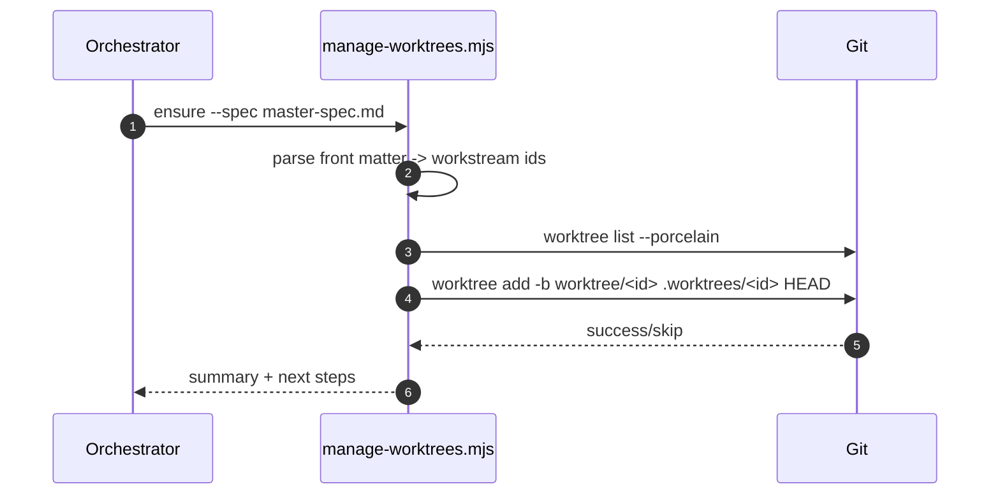

# Orchestrator Worktree Manager

## Context

Orchestrator mode coordinates multiple workstreams in parallel. A single CLI should manage per-workstream git worktrees so the orchestrator can create, list, inspect, and clean worktrees without interfering with other workstreams.

## Goals / Non-goals

- Goals:
  - Provide a single script to create and manage `.worktrees/<workstream-id>` directories.
  - Support workstream discovery from MasterSpec or explicit lists.
  - Keep operations idempotent and safe by default.
- Non-goals:
  - Automated merges, rebases, or remote syncs.
  - Managing worktrees across multiple repositories.

## Requirements

- Resolve workstream IDs from `--spec`, `--workstreams`, or `--workstreams-root`.
- Create missing worktrees under `.worktrees/` with a configurable branch prefix.
- Report worktrees under `.worktrees/` with branch and clean/dirty state.
- Remove worktrees only when explicitly selected; require `--force` for dirty removals.
- Support `git worktree prune` with optional `--dry-run`.
- Fail fast with clear errors when run outside a git repo or when inputs are invalid.

## Core Flows

- Ensure worktrees: parse inputs -> check existing worktrees -> create missing ones -> report summary.
- Inspect: list or status for worktrees under `.worktrees/`.
- Cleanup: remove specified worktrees, optionally force, then prune.

## Sequence Diagram(s)

## Edge Cases

- Worktree path exists but is not registered -> error with remediation hint.
- Branch already checked out in another worktree -> error with path reference.
- Dirty worktrees blocked from removal without `--force`.
- Missing or invalid spec file -> error with usage.

## Interfaces & Data Model

- CLI interface: `manage-worktrees.mjs <command> [options]`.
- Workstream sources:
  - MasterSpec front matter `workstreams` list.
  - Explicit `--workstreams` list (comma-separated).
  - Workstream spec front matter `id` from `--workstreams-root`.

## Security

- Require explicit `--force` for destructive removals.
- Avoid shell eval; invoke git commands directly.

## Additional considerations

- Best-practices references (if applicable): None.
- Keep output terse and script-friendly.

## Task List

- Implement `manage-worktrees.mjs` with `ensure`, `list`, `status`, `remove`, `prune`.
- Update orchestrator workflow and tool docs to reference the new script.
- Update Memory Bank documentation for orchestrator worktree management.

## Testing

- Manual CLI validation for each command; verify error paths for missing inputs and dirty removals.

## Open Questions

- None.

## Decision & Work Log

- Decision: Use a dedicated `manage-worktrees.mjs` CLI with safe defaults and explicit `--force`.
- Approval: User requested one-off spec workflow and asked for a comprehensive orchestrator worktree manager (2025-12-21).
- Work Log: Added `manage-worktrees.mjs`, updated orchestrator workflow, Memory Bank, and tools docs.
