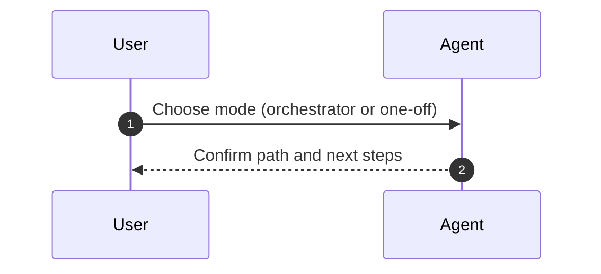

# Mode Selection + Top-Level Guidance

## Context

User-directed mode selection is the entrypoint for the spec-first orchestration system. Guidance must make the orchestrator vs one-off split explicit, and document one-off vibe vs one-off spec behavior without changing implementation flow.

## Goals / Non-goals

- Goals:
  - Provide a clear decision tree for orchestrator vs one-off.
  - Explain one-off vibe vs one-off spec paths, including approvals required for specs.
  - Preserve the one-off spec workflow (`agents/workflows/oneoff-spec.workflow.md`) for one-off spec execution.
- Non-goals:
  - Implement orchestration runtime or automation scripts.
  - Modify product feature requirements outside the agent system.

## Requirements

- The guidance shall prompt for explicit mode selection when the user does not specify one.
- The guidance shall document one-off vibe as a no-spec, small-scope path.
- The guidance shall document one-off spec as a single spec using the required section schema with approvals logged.
- The guidance shall treat user selection as the sole threshold for orchestrator vs one-off.
- The guidance shall reference the relevant workflow files for each mode.
- The guidance shall remove references to ephemeral context and point approvals to the Decision & Work Log in specs.

## Core Flows

- User selects orchestrator mode; orchestration proceeds through ProblemBrief, workstream specs, and MasterSpec gates.
- User selects one-off mode; agent asks for vibe vs spec and proceeds accordingly.
- One-off spec path uses the one-off spec workflow (`agents/workflows/oneoff-spec.workflow.md`) after spec approval.

## Sequence Diagram(s)

## Edge Cases

- User does not choose a mode; prompt for a selection before proceeding.
- User requests both modes in a single prompt; ask for a primary path.
- User selects one-off vibe for a large request; recommend switching to orchestrator or one-off spec.

## Interfaces & Data Model

- Update `AGENTS.md` and referenced guidance to include the decision tree and workflow references.
- No new data models are required.

## Existing Docs Audit

- Update: `agents/memory-bank.md` to remove `agents/ephemeral` references and align retrieval guidance with spec-based logs.
- Keep: `agents/memory-bank/project.brief.md` as project context; revise only if spec-first goals change.
- Keep: `agents/memory-bank/product.context.md` as product context placeholder.
- Keep: `agents/memory-bank/tech.context.md` as technical context placeholder.
- Update: `agents/memory-bank/testing.guidelines.md` to reference spec-based acceptance criteria and evidence.

## Security

- Not applicable; guidance-only changes.

## Additional considerations

- Keep guidance concise and avoid duplicating workflow content.
- Ensure all references point to the canonical workflow files.

## Task List

- Draft the mode-selection decision tree and one-off vibe/spec guidance in top-level docs.
- Reference the one-off overview plus the spec/vibe workflows alongside orchestrator/spec-author/implementer workflows.
- Update Memory Bank guidance to remove ephemeral references and align approvals to the Decision & Work Log.
- Update testing guidance to reference spec-based acceptance criteria and evidence.
- Validate updates with `npm run agent:finalize`.

## Testing

- `npm run agent:finalize`
- Manual review of the guidance for clarity and consistency.

## Open Questions

- None.

## Decision & Work Log

- Decision: User selection is the only threshold for orchestrator vs one-off.
- Approval: Pending confirmation once guidance updates are reviewed.
- Work Log: Updated AGENTS and Memory Bank guidance to reflect mode selection, workflow references, and Decision & Work Log approvals.
- Work Log: Aligned workflow and guidance docs to log reflections in task specs and avoid active context references.
- Work Log: Renamed the default workflow to `agents/workflows/oneoff.workflow.md` for one-off spec guidance.
- Work Log: Added Task List section aligned to Requirements and Design.
- Work Log: Split one-off workflow into overview + spec/vibe files and updated references.
