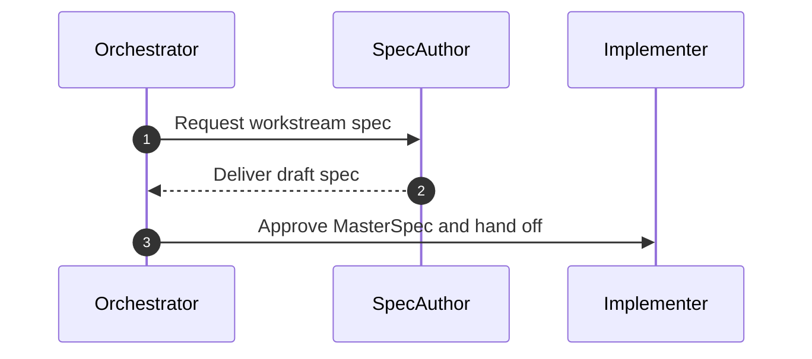

# Workflow Library + Run-Loop

## Context

The workflow library is the operational backbone for spec-first orchestration. Each workflow must capture phases, inputs/outputs, and gates so the run-loop is explicit and enforceable.

## Goals / Non-goals

- Goals:
  - Define orchestrator, spec-author, implementer, and one-off workflows with clear phase gates.
  - Encode the spec-first run-loop and handoffs across workflows.
  - Preserve the default workflow for one-off spec execution.
- Non-goals:
  - Implement automation beyond documented steps.
  - Replace the existing default workflow for non-orchestrator tasks.

## Requirements

- The orchestrator workflow shall define decomposition, spec assignment, merge, and spec-complete gates.
- The spec-author workflow shall require the standard section schema and Decision & Work Log updates.
- The implementer workflow shall gate execution on an approved MasterSpec.
- The one-off workflow shall document vibe vs spec variants and their gates.
- The workflows shall reference spec validation and merge tooling where applicable.
- The workflow library shall remove references to `agents/ephemeral` and log progress directly in specs.

## Core Flows

- Orchestrator requests workstream specs, merges them into a MasterSpec, and verifies spec-complete gates before implementation.
- Spec authors produce workstream specs using the required section schema and log approvals.
- Implementer executes only after MasterSpec approval.
- One-off vibe executes with minimal context; one-off spec executes after a single spec approval.

## Sequence Diagram(s)

## Edge Cases

- Workstream spec missing required sections; gate fails and spec author revises.
- Conflicting contracts across workstreams; return to spec authors for resolution.
- Spec merge reports cyclic dependencies; orchestrator resolves dependency graph.

## Interfaces & Data Model

- Workflow files live under `agents/workflows/*.workflow.md` and reference templates and scripts.
- No new data models are required beyond existing workflow metadata.

## Existing Docs Audit

- Update: `agents/workflows.md` to remove `agents/ephemeral` references and align usage with spec-first workflows.
- Update: `agents/workflows/default.workflow.md` to replace per-task specs/active context with spec-first spec artifacts and Decision & Work Log.
- Update: `agents/workflows/orchestrator.workflow.md` stub into a spec-first orchestration workflow.
- Update: `agents/workflows/spec-author.workflow.md` stub into a spec-author workflow with required sections.
- Update: `agents/workflows/implementer.workflow.md` stub into a spec-driven implementation workflow.
- Update: `agents/workflows/oneoff.workflow.md` stub into a one-off workflow covering vibe vs spec.
- Update: `agents/workflows/templates/pattern.workflow.template.md` to align with spec-first and remove `agents/ephemeral` references.
- Update: `agents/memory-bank/operating-model.md` to reflect spec-first phases and remove active context guidance.

## Security

- Not applicable; documentation-only changes.

## Additional considerations

- Keep the default workflow intact and reference it explicitly for one-off spec execution.
- Ensure workflows call out approval logging requirements.

## Testing

- `npm run agent:finalize`
- Manual walkthrough of workflow checklists to confirm gate clarity.

## Open Questions

- None.

## Decision & Work Log

- Decision: Orchestrator must record spec-complete approval before implementation begins.
- Approval: Pending workflow review.
