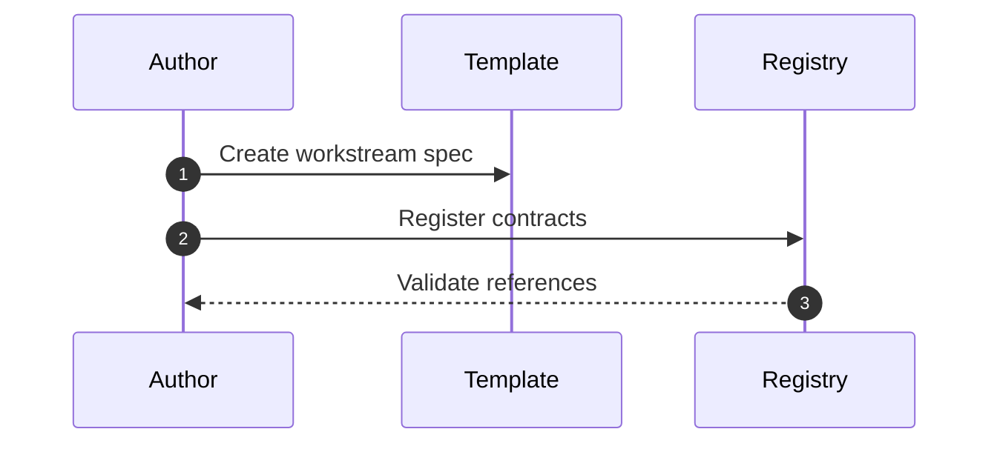

# Spec Schema + Templates + Contract Registry

## Context

Spec authors need consistent schemas and templates to produce machine-checkable specs. The contract registry anchors cross-spec interfaces and ownership.

## Goals / Non-goals

- Goals:
  - Provide templates for ProblemBrief, WorkstreamSpec, and MasterSpec.
  - Enforce the required section list and Decision & Work Log in every spec.
  - Define the contract registry schema and location.
- Non-goals:
  - Populate the contract registry with real contracts.
  - Author the actual workstream specs (handled in other workstreams).

## Requirements

- The WorkstreamSpec template shall include all required sections listed in the spec-orchestration design.
- The WorkstreamSpec template shall include a Sequence Diagram(s) section with a Mermaid diagram for the primary flow (aligned to `agents/memory-bank/task-spec.guide.md`).
- The Decision & Work Log section shall be mandatory and include user approvals.
- The WorkstreamSpec template shall include a Task List derived from Requirements and Design.
- The MasterSpec template shall list workstream ids, contracts, and gates.
- The contract registry shall include id, type, path, owner, and version fields.
- One-off spec usage shall reuse the same section schema as workstream specs.
- The spec file layout shall replace `agents/ephemeral/**` with durable specs under `agents/specs/**`.
- The spec system shall define a best-practices knowledge library under `agents/memory-bank/best-practices/` for tribal knowledge.
- The best-practices library shall include a TypeScript best-practices doc as an initial seed.
- Spec templates shall include a place to reference relevant best-practices docs when applicable.

## Core Flows

- Orchestrator creates ProblemBrief and MasterSpec from templates.
- Spec authors create workstream specs from templates and register any contracts.
- Contracts are referenced by id from workstream specs and validated in the registry.

## Sequence Diagram(s)

## Edge Cases

- Missing required section in a spec; validation fails and spec must be updated.
- Contract id collision; registry validation flags conflict.
- Spec references a contract id not present in the registry.

## Interfaces & Data Model

- Templates under `agents/specs/templates/`.
- Schemas under `agents/specs/schema/`.
- Registry at `agents/contracts/registry.yaml`.
- Best-practices docs under `agents/memory-bank/best-practices/` with lightweight metadata (id, domain, tags, last_reviewed).

## Existing Docs Audit

- Update: `agents/memory-bank/task-spec.guide.md` to rewrite the spec guide for the new system and remove `agents/ephemeral` references.
- Update: `agents/memory-bank/spec-orchestration.design.md` to reflect the new spec-first file layout and Decision & Work Log usage.
- Update: `agents/memory-bank/spec-orchestration.design.md` required section list to include Task List guidance.
- Update: `agents/memory-bank/spec-first-orchestration-master-spec.md` to align with updated spec layout and contract registry references.
- Update: `agents/memory-bank.md` retrieval policy to include best-practices docs when relevant.
- Update: `agents/specs/README.md` to document the new spec-first directory layout and durable context storage.
- Update: `agents/specs/templates/README.md` to replace placeholders with ProblemBrief/WorkstreamSpec/MasterSpec templates.
- Update: `agents/specs/schema/README.md` to replace placeholders with spec validation schemas.
- Add: `agents/memory-bank/best-practices/README.md` as the index for tribal knowledge docs.
- Add: `agents/memory-bank/best-practices/typescript.md` for TypeScript best practices.
- Keep: `agents/specs/spec-first-orchestration/workstreams/ws-1-mode-selection.md` as the current WS-1 spec (update as needed).
- Keep: `agents/specs/spec-first-orchestration/workstreams/ws-2-workflow-library.md` as the current WS-2 spec (update as needed).
- Keep: `agents/specs/spec-first-orchestration/workstreams/ws-3-spec-schema.md` as the current WS-3 spec (update as needed).
- Keep: `agents/specs/spec-first-orchestration/workstreams/ws-4-tooling-gates.md` as the current WS-4 spec (update as needed).
- Delete: `agents/ephemeral/active.context.md` because ephemeral context is replaced by spec-based logs.
- Delete: `agents/ephemeral/task-specs/2025-11-26-agent-instruction-rewrite.md` after migration to durable specs.
- Delete: `agents/ephemeral/task-specs/2025-12-17-remove-memory-stamp.md` after migration to durable specs.
- Delete: `agents/ephemeral/task-specs/2025-12-20-pinnacle-spec-orchestrator-design.md` after migration to durable specs.
- Delete: `agents/ephemeral/task-specs/2025-12-20-spec-first-workstream-specs.md` after migration to durable specs.
- Delete: `agents/ephemeral/task-specs/2025-12-20-spec-guide-sequence-diagram.md` after migration to durable specs.
- Delete: `agents/ephemeral/task-specs/2025-12-20-spec-docs-audit.md` after migration to durable specs.

## Security

- Ensure specs and registry entries avoid embedding secrets.

## Additional considerations

- Keep templates concise while making required sections explicit.
- Provide short guidance text in templates to minimize ambiguity.
- Keep best-practices docs focused on actionable guidance and avoid duplicating spec content.

## Task List

- Create WorkstreamSpec template with required sections, Task List, Decision & Work Log, and best-practices references.
- Create ProblemBrief and MasterSpec templates aligned to the spec-first schema.
- Define the contract registry schema and document registry usage.
- Add the best-practices index and a TypeScript starter doc.
- Update spec-orchestration design required section list to include Task List.
- Validate updates with `npm run agent:finalize`.

## Testing

- Schema validation fixtures for valid/invalid specs.
- `npm run agent:finalize` for path checks.

## Open Questions

- None.

## Decision & Work Log

- Decision: One-off spec uses the same section schema as workstream specs.
- Approval: Pending template review.
- Work Log: Added Task List as a required WorkstreamSpec section derived from Requirements and Design.
- Work Log: Added ProblemBrief/MasterSpec templates, schema docs/files, best-practices library, and contract registry guidance.
