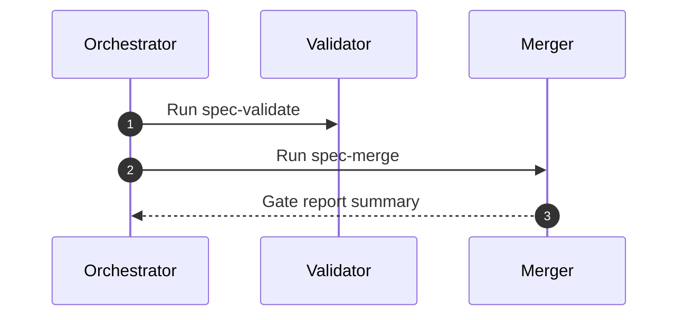

# Tooling + Validation Gates

## Context

Tooling ensures the spec-complete gates are enforceable. Validation and merge scripts must be deterministic, repeatable, and aligned with workflow expectations.

## Goals / Non-goals

- Goals:
  - Define `spec-validate` behavior for schema and required section checks.
  - Define `spec-merge` behavior for MasterSpec generation and conflict detection.
  - Define a `spec:finalize` (or equivalent) gate that runs validation plus memory checks.
- Non-goals:
  - Build a full orchestration runtime or external integrations.
  - Generate implementation tasks automatically.

## Requirements

- `spec-validate` shall validate YAML front matter, required sections, and registry references.
- `spec-merge` shall generate a MasterSpec and detect conflicts or cyclic dependencies.
- The gate report shall summarize spec-complete status and unresolved issues.
- CLI interfaces shall accept input paths, registry path, and output path.
- Tooling shall restrict writes to `agents/specs/` to avoid unsafe output paths.
- Tooling guidance shall remove references to `agents/ephemeral` scripts and focus on spec-first tooling.
- `npm run agent:finalize` shall remain the default completion gate when an agent finishes a task.

## Core Flows

- Orchestrator runs `spec-validate` for each workstream spec.
- Orchestrator runs `spec-merge` to generate MasterSpec and a gate report.
- Orchestrator attaches the gate report summary to the Decision & Work Log.

## Sequence Diagram(s)

## Edge Cases

- Invalid YAML or missing required sections; `spec-validate` exits non-zero with actionable errors.
- Cyclic dependencies in workstreams; `spec-merge` fails with cycle report.
- Contract registry conflicts; validation reports collisions.

## Interfaces & Data Model

- CLI arguments: input spec paths, registry path, output path, and optional report path.
- Outputs: MasterSpec file plus a gate report summary (Markdown or JSON).

## Existing Docs Audit

- Update: `agents/tools.md` to replace `append-memory-entry` and `reset-active-context` guidance with spec-first tooling and validation gates.

## Security

- Validate and sanitize file paths; avoid writing outside the repo.

## Additional considerations

- Keep tooling deterministic for reviewability and consistent diffs.
- Provide clear error messages for spec authors.

## Testing

- Fixture inputs for valid/invalid specs.
- `npm run agent:finalize` to ensure validation hooks remain compatible with repo checks.

## Open Questions

- None.

## Decision & Work Log

- Decision: Orchestrator must attach gate report summary to the Decision & Work Log.
- Approval: Pending tooling design review.
- Work Log: Deprecated append-memory-entry, trimmed the active task index to metadata only, and updated load-context to include the current task spec.
- Work Log: Recorded `npm run agent:finalize` as the default completion gate for completed tasks.
